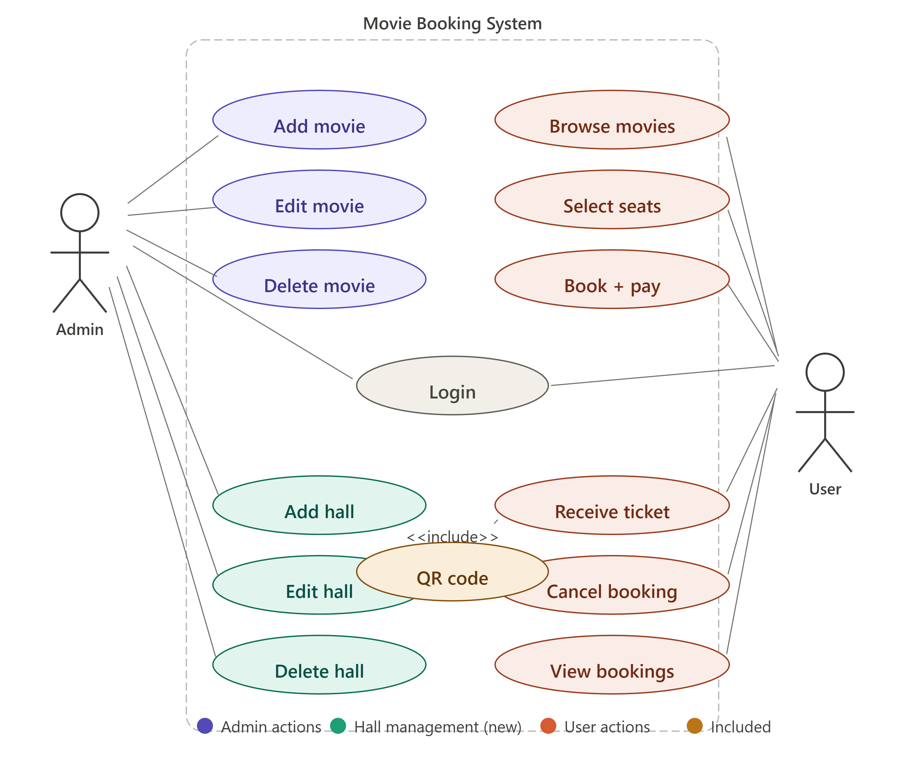
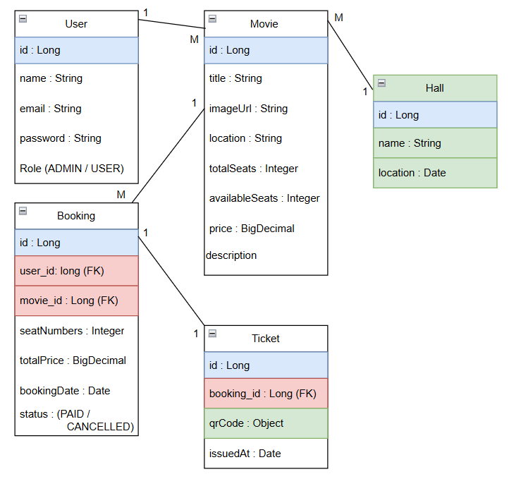

# Cinema-ticket-Booking-System-
Movie Booking System 🎬 A full-stack cinema ticket booking web application built with Spring Boot (Backend) and React (Frontend), featuring JWT authentication, interactive seat selection, QR code e-tickets, and an admin dashboard for managing movies and halls

# Frontend Architecture
Browser (Vite + React 18)
│
├── Pages
│   ├── Login / Register
│   ├── MovieList
│   ├── SeatSelection
│   ├── Ticket
│   ├── MyBookings
│   └── Admin Dashboard
│       ├── AdminMovieList
│       └── AdminHallList
│
├── Components (Shared)
│   ├── Navbar
│   ├── ProtectedRoute
│   ├── MovieCard
│   └── MovieForm
│
├── Context
│   └── AuthContext (user, login, logout, role)
│
├── Router (React Router v6)
│   ├── Public  →  / , /login , /register , /movies/:id
│   └── Protected → /ticket , /my-bookings , /admin , /admin/halls
│
├── Services (Axios)
│   ├── api.js          → Axios instance + JWT interceptor
│   ├── authService.js  → login, register
│   ├── movieService.js → getAll, getById
│   ├── bookingService.js → create, getMyBookings, cancel
│   └── hallService.js  → getHalls, addHall, updateHall, deleteHall
│
└── Storage
    └── localStorage    → token, user (role, name, email)

# Backend Architecture
Spring Boot 4.x (:8080)
│
├── Security Layer
│   ├── JwtAuthFilter          → Validates JWT on every request
│   ├── JwtUtil                → Generate & validate JWT tokens
│   ├── SecurityConfig         → Route-level authorization rules
│   ├── CorsConfig             → Allow requests from localhost:5173
│   └── BCryptPasswordEncoder  → Password hashing
│
├── Controller Layer (@RestController)
│   ├── AuthController         → POST /api/auth/login , /register
│   ├── MovieController        → GET  /api/movies , /movies/:id
│   ├── AdminController        → POST/PUT/DELETE /api/admin/movies
│   ├── AdminHallController    → POST/PUT/DELETE /api/admin/halls
│   ├── HallController         → GET  /api/halls
│   └── BookingController      → POST/GET/DELETE /api/bookings
│
├── Service Layer (@Service)
│   ├── AuthService            → Register, login, token generation
│   ├── MovieService           → CRUD + image upload
│   ├── HallService            → CRUD + movie count per hall
│   ├── BookingService         → Create booking + Pessimistic Lock
│   └── TicketService          → QR Code generation (ZXing)
│
├── Repository Layer (JpaRepository)
│   ├── UserRepository         → findByEmail, existsByEmail
│   ├── MovieRepository        → findAll, findByIdForUpdate (LOCK)
│   ├── HallRepository         → existsByName, countByHallId
│   ├── BookingRepository      → findByUser, findByMovieId
│   └── TicketRepository       → findByBookingId
│
├── Model Layer (@Entity)
│   ├── User                   → id, name, email, password, role
│   ├── Hall                   → id, name
│   ├── Movie                  → id, title, imageUrl, hall, seats, price
│   ├── Booking                → id, user, movie, seatNumbers, status
│   └── Ticket                 → id, booking, qrCode (LONGTEXT)
│
├── DTO Layer
│   ├── LoginRequest / RegisterRequest / AuthResponse
│   ├── MovieDTO / HallRequest / HallDTO
│   └── BookingRequest / BookingResponse
│
└── Database (MySQL — Hibernate ddl-auto: update)
    ├── users
    ├── halls
    ├── movies    → FK: hall_id
    ├── bookings  → FK: user_id, movie_id
    ├── tickets   → FK: booking_id
    └── uploads/  → Movie poster images (local folder)
# UseCase 

# Class Diagram 

